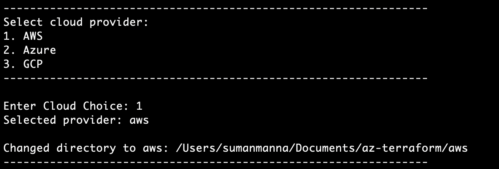
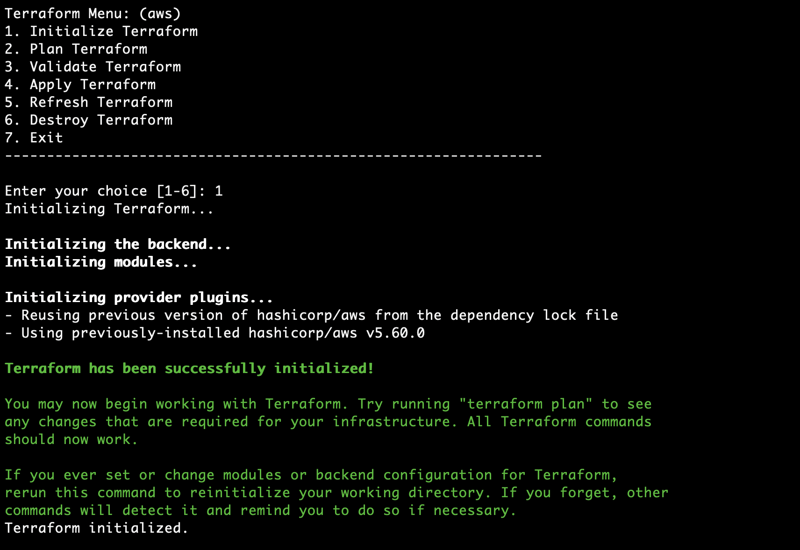
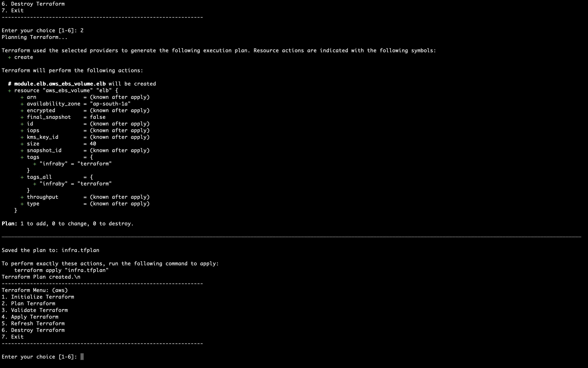
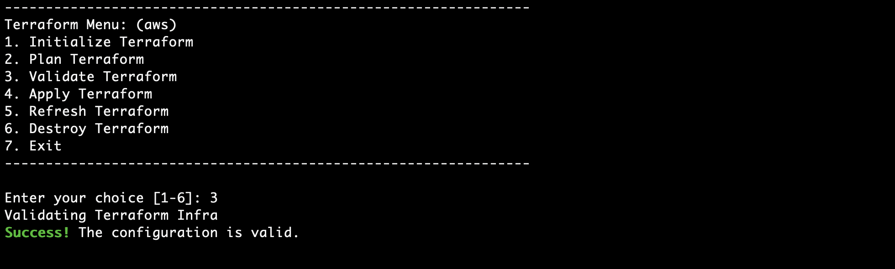
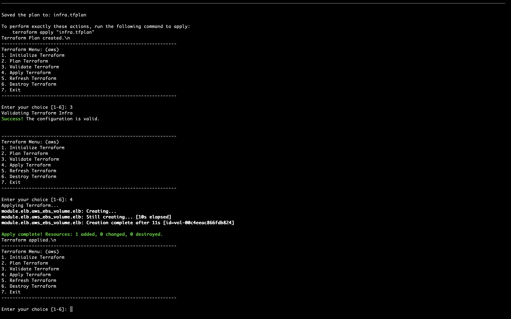
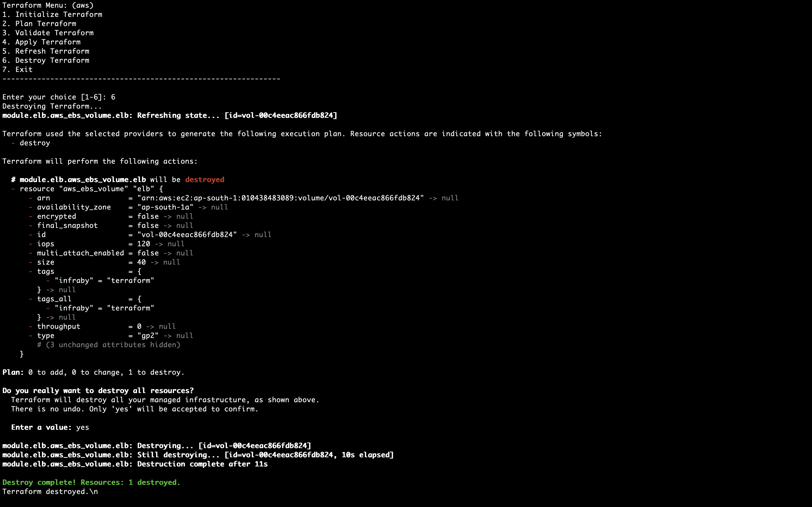

# Multi-Cloud Infrastructure with Terraform

This repository contains Terraform configurations for provisioning and managing infrastructure across multiple cloud providers, including AWS, Azure, and Google Cloud Platform (GCP). It provides a unified and scalable approach to managing cloud resources using Infrastructure as Code (IaC) principles.

## Features

- **Multi-Cloud Support**: Configurations for AWS, Azure, and GCP.
- **Modular Design**: Reusable modules for common infrastructure components.
- **Scalable Architecture**: Designed to handle varying infrastructure needs.
- **Automated Provisioning**: Easily deploy and manage cloud resources with Terraform.
- **Best Practices**: Implements industry best practices for security and efficiency.
- **Unified Operations**: `script.sh` file to automate operations across all cloud providers.

## Getting Started

1. **Clone the Repository**:

   ```bash
   git clone https://github.com/sumanmanna134/Multi-Cloud-Infrastructure-Terraform.git
   ```

2. **Install Terraform**: Follow the [Terraform installation guide](https://learn.hashicorp.com/terraform/getting-started/install) to set up Terraform on your local machine.

3. **Run Operations**: Use the `script.sh` file to execute operations across all cloud providers:

   ```bash
   chmod +x script.sh
   ./script.sh
   ```

4. **Select Cloud Provider**:

   

5. **Initialize Terraform of Selected Cloud Provider**:

   

6. **Terraform Plan**:

   

7. **Terraform Validate**:

   

8. **Terraform Apply**:

   

9. **Terraform Destroy**:

   

## Directory Structure

- `aws/` - Terraform configurations for AWS.
- `azure/` - Terraform configurations for Azure.
- `gcp/` - Terraform configurations for GCP.
- `modules/` - Shared modules used across different cloud providers.
- `script.sh` - Script for automating operations across all cloud providers.

## Contributing

Contributions are welcome! Please submit a pull request with a description of the changes and why they are needed.

## License

This project is licensed under the MIT License - see the [LICENSE](LICENSE) file for details.

## Contact

For any questions or feedback, please open an issue or contact me directly.

---

Let me know if you need any more changes!
